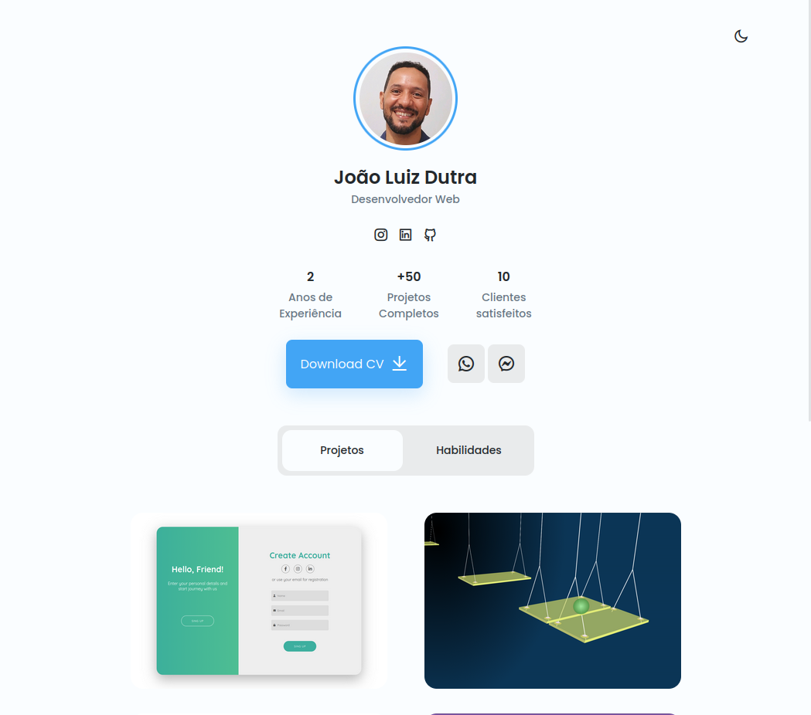
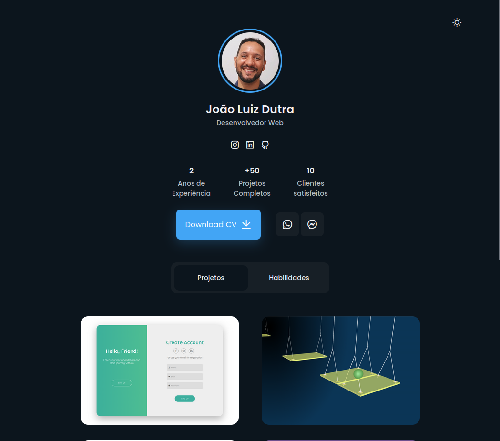

# Mini portfolio de João Luiz Dutra

[Acesse o projeto através desse link](https://jdutra-portfolio-1.netlify.app).

Website mini portfolio, esse é um mini projeto desenvolido apartir de um layout criado por **Bedimcode** onde esse projeto sofreu uma série de modifações para adaptar a minha necessidade, utilizando alguma propriedades diferentes, mais familiares para mim, e acrescentando alguma funções que não existiam na versão original.

O objetivo desse projeto é acadêmico, onde pude estudar uma série de recursos avançados de HTML, CSS e JavaScript.

Caracteristicas do projeto:

- Website, mini portfolio responsivo utilizando HTML, CSS, e JavaScript.
- Contém animações em CSS.
- Inclui modo Claro e Escuro.
- Desenvolvido utilizando a metodologia 'mobile first' e depois 'desktop'.
- Compativel com todos tamanhos de dispositivos.
- Interface de usuário simples, bonita e agradável

 

 
___________________________________________________________________________________
CRÉDITOS LAYOUT:

💙 Join the channel to see more videos like this. [Bedimcode](https://www.youtube.com/c/Bedimcode)